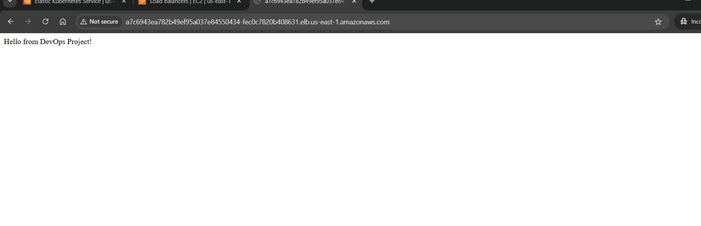

#  DevOps Kubernetes End-to-End Project
## Project Output



##  Project Overview

This project demonstrates a complete **DevOps workflow** from application development to deployment on Kubernetes using:

* Docker
* Kubernetes (EKS)
* Helm
* Ingress (AWS Load Balancer)
* ConfigMaps & Secrets
* HPA (Horizontal Pod Autoscaler)

---

#  What I Learned

### 🔹 Kubernetes Concepts

* Kubernetes Architecture & Components
* Deployments, ReplicaSets, DaemonSets
* Services (ClusterIP, NodePort)
* Ingress Controller & Load Balancer
* Namespaces

### 🔹 Resource Management

* CPU & Memory Requests and Limits
* Impact of not setting limits (node overload)
* Pod-level resource control

### 🔹 Scaling

* Horizontal Pod Autoscaler (HPA)
* Metrics Server usage
* Auto scaling based on CPU utilization

### 🔹 Configuration Management

* ConfigMaps for environment variables
* Secrets for sensitive data

### 🔹 Health Checks

* Liveness Probe (restart unhealthy container)
* Readiness Probe (control traffic flow)

---

#  Application Details

A simple **Flask application** with endpoints:

* `/` → Hello message
* `/env` → Environment variable
* `/health` → Health check

---

#  DevOps Workflow

## 1️ Application Code

* Python Flask app
* requirements.txt

---

## 2️ Dockerization

* Created Dockerfile
* Built Docker image
* Tested locally using:

```bash
docker run -p 5000:5000 <image>
```

---

## 3️ Push to DockerHub

```bash
docker build -t poovarasane/mydevopsapp:v1 .
docker push poovarasane/mydevopsapp:v1
```

---

## 4️ Kubernetes Deployment

* Created:

  * Deployment
  * Service
  * Ingress

---

## 5️ Expose Application

Flow:

```
User → AWS LoadBalancer → Ingress → Service → Pods
```

---

## 6️ Configurations Added

* ConfigMap → ENV variables
* Secret → DB_PASSWORD
* Resource Limits → CPU/Memory
* Liveness & Readiness Probes

---

## 7️ Autoscaling

```bash
kubectl autoscale deployment mydevops-deployment \
  --cpu-percent=50 --min=1 --max=5
```

---

## 8️ Helm Implementation

Converted all YAML into Helm Chart:

* values.yaml
* deployment.yaml
* service.yaml
* ingress.yaml
* configmap.yaml
* secret.yaml

---

# Deployment Automation Script

Created a shell script:

```bash
#!/bin/bash
set -e

IMAGE="poovarasane/mydevopsapp"
TAG="v2"

git pull origin main
docker build -t $IMAGE:$TAG .
docker push $IMAGE:$TAG

helm upgrade --install mydevopsapp ./mychart \
  --set container.image=$IMAGE:$TAG
```

---

#  Issues Faced & Fixes

### CrashLoopBackOff

* Cause: App / container issue
* Fix: Checked logs using `kubectl logs`

---

###  Image not updating

* Cause: Same image tag
* Fix:

```yaml
imagePullPolicy: Always
```

---

###  ConfigMap not found

* Cause: Not included in Helm
* Fix: Added configmap.yaml in chart

---

###  Git clone authentication issue

* Cause: Using HTTPS
* Fix: Configured SSH keys

---

#  Debugging Commands Used

```bash
kubectl get pods
kubectl describe pod <pod>
kubectl logs <pod>
kubectl rollout restart deployment <name>
```

---

#  Final Output

Application successfully accessed via:

```
AWS LoadBalancer URL → Ingress → App
```

---

#  Key Takeaways

* End-to-end DevOps pipeline understanding
* Real-time debugging skills
* Kubernetes production-level concepts
* Helm-based deployments
* Image versioning importance

---

#  Future Improvements

* CI/CD using Jenkins / GitHub Actions
* Terraform for infrastructure
* Monitoring using Prometheus & Grafana

---

#  Conclusion

This project helped me understand **real-world DevOps workflows** including:

```
Code → Docker → Registry → Kubernetes → Helm → Ingress → Production
```

---

 *This project marks my transition from Linux Admin to DevOps Engineer.*

---
